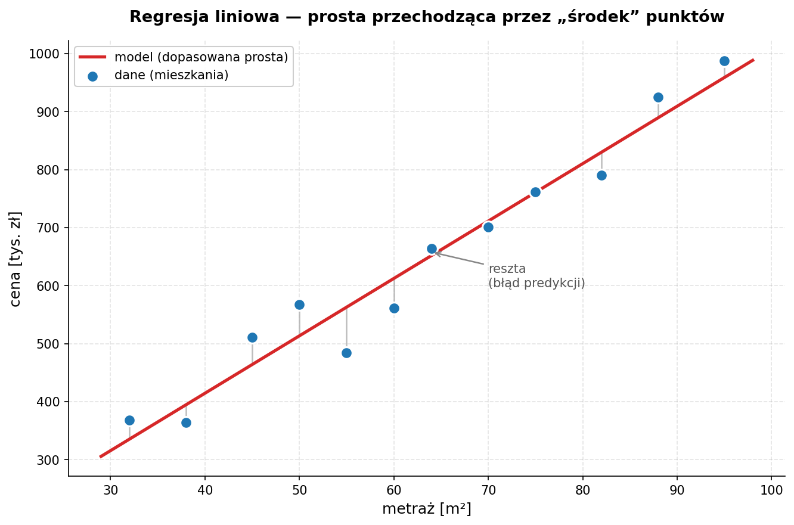

# Zajęcia 4

## Regresja liniowa — od danych do działającego modelu

> **Poprzednie zajęcia:** poznaliśmy NLP i spaCy, a wcześniej zbudowaliśmy solidny fundament OOP.
> Dziś robimy duży krok w stronę **uczenia maszynowego**. Zbudujemy nasz pierwszy model predykcyjny — regresję liniową — ale (uwaga!) **nie zaczniemy od trenowania**. Zaczniemy od zrozumienia danych, bo "garbage in, garbage out" to nie jest tylko ładny cytat.

Po dzisiejszych zajęciach będziesz w stanie:

- wyjaśnić, czym jest regresja liniowa i co model tak naprawdę "uczy się" z danych,
- przeprowadzić **analizę zbioru (EDA)** zanim cokolwiek wytrenujesz,
- świadomie podzielić dane na zbiór treningowy i walidacyjny — i wiedzieć, **po co** to robimy,
- wytrenować model regresji w `scikit-learn` w kilku linijkach,
- **ocenić jakość modelu** za pomocą MAE, RMSE i R² oraz wykresu reszt,
- rozpoznać, kiedy model jest dobry, a kiedy tylko udaje, że jest.

> **Środowisko:** Google Colab. Wszystkie biblioteki (`numpy`, `pandas`, `matplotlib`, `scikit-learn`) są tam już zainstalowane.

---

## 1. Co to jest regresja liniowa?

### Intuicja

Wyobraź sobie, że masz dane o mieszkaniach: metraż i cenę. Patrzysz na wykres punktowy i widzisz, że im większy metraż, tym wyższa cena. Punkty układają się mniej więcej w **linię prostą**.

Regresja liniowa to nic innego jak **znalezienie tej najlepszej prostej** — takiej, która przechodzi "jak najbliżej" wszystkich punktów. Mając taką prostą, możemy przewidzieć cenę mieszkania, którego nie ma w danych: podajemy metraż, odczytujemy cenę z linii.



### Matematyka — mniej straszna niż wygląda

Dla **jednej cechy** (np. metraż) model to po prostu równanie prostej, które znasz ze szkoły:

```
ŷ = w · x + b
```

- `x` — cecha wejściowa (metraż),
- `ŷ` ("y daszek") — przewidywana wartość (cena),
- `w` — **waga** (slope, nachylenie) — o ile rośnie cena, gdy metraż rośnie o 1 m²,
- `b` — **wyraz wolny** (intercept) — wartość, gdy `x = 0`.

Dla **wielu cech** (metraż, liczba pokoi, piętro, ...) prosta zamienia się w hiperpłaszczyznę, a równanie rośnie:

```
ŷ = w₁·x₁ + w₂·x₂ + w₃·x₃ + ... + wₙ·xₙ + b
```

To wciąż **liniowy** model — każda cecha ma swoją wagę, a my je sumujemy. Cała magia "uczenia" polega na znalezieniu takich `w` i `b`, które dają najlepsze predykcje.

### Czego model się "uczy"?

Model szuka wag, które **minimalizują błąd** między predykcją `ŷ` a rzeczywistą wartością `y`. Najczęściej używaną miarą błędu jest **MSE** (Mean Squared Error — średni błąd kwadratowy):

```
MSE = (1/n) · Σ (yᵢ - ŷᵢ)²
```

Czyli: dla każdego punktu liczymy różnicę (rzeczywista − przewidziana), podnosimy do kwadratu (żeby plusy i minusy się nie kasowały, i żeby duże błędy bolały bardziej), i uśredniamy.

> **Po co kwadrat?** Gdybyśmy sumowali same różnice, błąd +10 i −10 dałyby 0 — model wyglądałby na idealny, mimo że się myli. Kwadrat to naprawia: każdy błąd jest dodatni, a te duże ważą nieproporcjonalnie więcej.

Algorytm (pod maską `scikit-learn` to metoda najmniejszych kwadratów) dobiera `w` i `b` tak, żeby ta liczba była **jak najmniejsza**. Na szczęście nie musimy robić tego ręcznie — od tego mamy bibliotekę.

### 🏋️ Zadanie 4.1 — Intuicja i ręczna predykcja (3 pkt)

Zanim sięgniemy po `scikit-learn`, poczujmy mechanikę "na piechotę".

Załóżmy, że ktoś wytrenował dla nas prosty model ceny mieszkania:

```
cena = 9500 · metraż + 50000
```

(czyli `w = 9500`, `b = 50000`)

1. **(1 pkt)** Napisz funkcję `predict(metraz: float) -> float`, która zwraca przewidywaną cenę dla podanego metrażu. Przetestuj dla 40, 60 i 75 m².

2. **(1 pkt)** Masz prawdziwe ceny trzech mieszkań. Napisz funkcję `mse(y_true: list, y_pred: list) -> float`, która liczy MSE ręcznie (bez bibliotek). Policz MSE dla danych poniżej.

3. **(1 pkt)** Zmień `b` z `50000` na `100000` i policz MSE jeszcze raz. Czy błąd wzrósł, czy zmalał? Napisz w komentarzu, co to mówi o tym, który `b` jest lepszy.

```python
metraze   = [40, 60, 75]
ceny_real = [430000, 620000, 770000]

# y_pred = [predict(m) for m in metraze]
# print(mse(ceny_real, y_pred))
```

---

## 2. Najpierw dane, potem model — analiza zbioru (EDA)

> **Najważniejsza zasada dzisiejszych zajęć:** nie trenujesz modelu na danych, których nie rozumiesz. Etap EDA (*Exploratory Data Analysis*) to nie strata czasu — to moment, w którym łapiesz literówki, braki, wartości odstające i cechy, które w ogóle nic nie wnoszą. Pominięcie tego etapu to najczęstszy powód, dla którego "model nie działa".

### Wczytanie zbioru

Użyjemy gotowego, wbudowanego w `scikit-learn` zbioru **California Housing** — dane o cenach mieszkań w Kalifornii. Cechy są zrozumiałe (mediana dochodu, wiek budynku, liczba pokoi...), a celem jest mediana wartości domu.

```python
import pandas as pd
from sklearn.datasets import fetch_california_housing

dane = fetch_california_housing(as_frame=True)
df = dane.frame   # gotowy DataFrame z cechami + kolumną celu

print(df.shape)    # (20640, 9) — 20640 wierszy, 8 cech + 1 cel
df.head()
```

Kolumna celu nazywa się `MedHouseVal` (mediana wartości domu, w setkach tysięcy dolarów). Reszta kolumn to nasze cechy:

| Kolumna | Znaczenie |
|---|---|
| `MedInc` | mediana dochodu w dzielnicy |
| `HouseAge` | mediana wieku budynków |
| `AveRooms` | średnia liczba pokoi |
| `AveBedrms` | średnia liczba sypialni |
| `Population` | populacja dzielnicy |
| `AveOccup` | średnie zaludnienie domu |
| `Latitude` / `Longitude` | współrzędne geograficzne |
| `MedHouseVal` | **cel** — mediana wartości domu |

### Pierwsze spojrzenie — `info()` i `describe()`

```python
df.info()         # typy kolumn, ile wartości niepustych
df.describe()     # statystyki: min, max, średnia, kwartyle
```

Na co patrzymy:

- **Braki danych** — czy `info()` pokazuje mniej wartości niepustych niż wierszy? (tu akurat zbiór jest czysty, ale w prawdziwym świecie rzadko tak jest).
- **Zakresy** — czy `min`/`max` mają sens? Ujemny wiek budynku albo cena 0 to sygnał ostrzegawczy.
- **Wartości odstające (outliers)** — czy `max` nie odjeżdża absurdalnie od kwartyla 75% (`AveRooms` = 142 przy medianie ~5 to podejrzane).

### Rozkłady cech — histogramy

```python
import matplotlib.pyplot as plt

df.hist(bins=50, figsize=(14, 10))
plt.tight_layout()
plt.show()
```

Histogram od razu pokazuje, czy cecha ma sensowny rozkład, czy jest "zlepiona" przy jednej wartości albo ucięta (np. cena w tym zbiorze jest sztucznie obcięta przy 5.0 — to artefakt danych, dobrze o nim wiedzieć).

### Korelacje — które cechy w ogóle są przydatne?

Regresja liniowa lubi cechy, które są **liniowo powiązane** z celem. Sprawdźmy to:

```python
korelacje = df.corr()["MedHouseVal"].sort_values(ascending=False)
print(korelacje)
```

```
MedHouseVal    1.000000
MedInc         0.688075   ← dochód mocno koreluje z ceną — to będzie nasza gwiazda
AveRooms       0.151948
HouseAge       0.105623
...
```

Wniosek czytamy wprost: **`MedInc` (dochód) to najsilniejszy predyktor ceny**. Cechy o korelacji bliskiej zera prawdopodobnie niewiele wniosą do liniowego modelu.

> **Uwaga:** korelacja Pearsona wykrywa tylko **zależności liniowe**. Cecha może być świetnym predyktorem w sposób nieliniowy i mieć korelację ~0. Dlatego korelacja to wskazówka, nie wyrok.

### Wykres rozrzutu — zobacz zależność na oczy

```python
df.plot(kind="scatter", x="MedInc", y="MedHouseVal", alpha=0.1, figsize=(8, 6))
plt.show()
```

Widać tu wyraźny trend rosnący (im wyższy dochód, tym droższe domy) oraz tę poziomą "ścianę" na górze przy 5.0 — obcięcie ceny, które zauważyliśmy w histogramie.

### 🏋️ Zadanie 4.2 — Analiza zbioru (5 pkt)

Pracujesz na zbiorze California Housing (wczytaj jak wyżej).

1. **(1 pkt)** Wczytaj dane do DataFrame i wyświetl `shape`, `head()` oraz `info()`. W komentarzu napisz: ile jest wierszy, ile cech i czy są braki danych.

2. **(1 pkt)** Wywołaj `describe()` i znajdź **co najmniej jedną cechę z podejrzaną wartością odstającą** (porównaj `max` z kwartylem 75%). Napisz w komentarzu, która to cecha i dlaczego ją podejrzewasz.

3. **(1.5 pkt)** Narysuj histogramy wszystkich cech (`df.hist(...)`). Wskaż w komentarzu jedną cechę, której rozkład wygląda na "obcięty" lub mocno skośny.

4. **(1.5 pkt)** Policz korelacje cech z `MedHouseVal` i wyświetl je posortowane malejąco. Następnie narysuj wykres rozrzutu (`scatter`) dla cechy o **najwyższej** korelacji względem celu. Napisz w komentarzu, czy widać zależność liniową.

---

## 3. Podział na zbiór treningowy i walidacyjny

### Po co w ogóle dzielić dane?

Załóżmy, że trenujemy model na **wszystkich** danych, a potem na tych samych danych sprawdzamy jego jakość. Model dostanie świetny wynik — bo widział już te odpowiedzi! To jak ocenianie ucznia po pytaniu go o zadania, które wcześniej rozwiązaliście razem na tablicy. Nic to nie mówi o tym, czy poradzi sobie na **prawdziwym** egzaminie.

Dlatego dzielimy dane na dwa rozłączne kawałki:

| Zbiór | Do czego służy | Typowy udział |
|---|---|---|
| **Treningowy** (train) | model uczy się na nim wag `w`, `b` | ~70–80% |
| **Walidacyjny / testowy** (test) | sprawdzamy jakość na danych, których model **nigdy nie widział** | ~20–30% |

To jedyny uczciwy sposób, żeby ocenić, jak model zachowa się na nowych danych.

### Overfitting — uczeń, który wykuł odpowiedzi na pamięć

Jeśli model świetnie radzi sobie na treningu, ale słabo na teście — mamy **przeuczenie (overfitting)**. Model "wykuł" dane treningowe zamiast nauczyć się ogólnej reguły. Podział train/test jest naszym wykrywaczem tego problemu.

### `train_test_split`

`scikit-learn` robi podział za nas:

```python
from sklearn.model_selection import train_test_split

# X — cechy (wszystko oprócz celu), y — cel
X = df.drop(columns=["MedHouseVal"])
y = df["MedHouseVal"]

X_train, X_test, y_train, y_test = train_test_split(
    X, y,
    test_size=0.2,      # 20% danych ląduje w teście
    random_state=42     # ziarno losowości — żeby podział był powtarzalny
)

print(X_train.shape, X_test.shape)   # np. (16512, 8) (4128, 8)
```

> **`random_state=42`** — ustawienie ziarna gwarantuje, że za każdym uruchomieniem dostaniesz **ten sam** podział. Bez tego porównywanie wyników między uruchomieniami nie miałoby sensu. (Liczba 42 to żart programistów — może być dowolna, byle stała).

### 🏋️ Zadanie 4.3 — Podział danych (3 pkt)

1. **(1 pkt)** Rozdziel zbiór na cechy `X` (wszystkie kolumny oprócz celu) i wektor celu `y` (`MedHouseVal`).

2. **(1.5 pkt)** Podziel dane na treningowe i testowe w proporcji **75/25** (`test_size=0.25`), ustawiając `random_state=42`. Wyświetl kształty (`shape`) wszystkich czterech wynikowych zbiorów.

3. **(0.5 pkt)** W komentarzu odpowiedz krótko: dlaczego ustawiamy `random_state` i co by się stało, gdybyśmy oceniali model na zbiorze treningowym zamiast testowym?

---

## 4. Trenowanie modelu

Teraz część, na którą wszyscy czekali — i która, jak się okaże, jest **najkrótsza**. Cała ciężka praca była wcześniej.

```python
from sklearn.linear_model import LinearRegression

model = LinearRegression()
model.fit(X_train, y_train)   # <- tu dzieje się "uczenie"
```

Tyle. Po `fit()` model ma już dobrane wagi. Możemy je podejrzeć:

```python
print("Wyraz wolny (b):", model.intercept_)
print("Wagi (w):")
for cecha, waga in zip(X_train.columns, model.coef_):
    print(f"  {cecha:<12} {waga:.4f}")
```

Wagi są **interpretowalne** — to jedna z najpiękniejszych cech regresji liniowej. Dodatnia waga przy `MedInc` oznacza: "gdy dochód w dzielnicy rośnie, przewidywana cena rośnie". To nie czarna skrzynka — widzimy, na co model patrzy.

### Predykcja na nowych danych

```python
y_pred = model.predict(X_test)   # predykcje dla zbioru, którego model nie widział

# Porównanie kilku pierwszych predykcji z rzeczywistością:
for real, pred in zip(y_test[:5], y_pred[:5]):
    print(f"rzeczywista: {real:.2f}   przewidziana: {pred:.2f}")
```

### 🏋️ Zadanie 4.4 — Trenowanie i interpretacja (4 pkt)

1. **(1 pkt)** Wytrenuj `LinearRegression` na zbiorze treningowym z poprzedniego zadania.

2. **(1.5 pkt)** Wyświetl wyraz wolny oraz wagi dla wszystkich cech (ładnie sformatowane, z nazwami kolumn). Wskaż w komentarzu cechę o **największej dodatniej** i **największej ujemnej** wadze i napisz jednym zdaniem, jak je interpretujesz.

3. **(1.5 pkt)** Zrób predykcję na zbiorze testowym (`predict`) i wyświetl porównanie 5 pierwszych predykcji z wartościami rzeczywistymi. Czy model "trafia w okolice"?

---

## 5. Ewaluacja modelu — czy on jest w ogóle dobry?

Predykcje mamy. Teraz pytanie za 5 punktów: **jak dobre one są?** Do tego służą metryki.

### Trzy metryki, które musisz znać

```python
import numpy as np
from sklearn.metrics import mean_absolute_error, mean_squared_error, r2_score

mae  = mean_absolute_error(y_test, y_pred)
mse  = mean_squared_error(y_test, y_pred)
rmse = np.sqrt(mse)
r2   = r2_score(y_test, y_pred)

print(f"MAE:  {mae:.3f}")
print(f"RMSE: {rmse:.3f}")
print(f"R²:   {r2:.3f}")
```

| Metryka | Co mierzy | Jak czytać |
|---|---|---|
| **MAE** (Mean Absolute Error) | średni błąd bezwzględny | "średnio mylę się o tyle". W tych samych jednostkach co cel — łatwa do interpretacji |
| **RMSE** (Root MSE) | pierwiastek z MSE | jak MAE, ale **mocniej karze duże błędy**. Też w jednostkach celu |
| **R²** (współczynnik determinacji) | jaki % zmienności celu model wyjaśnia | 1.0 = ideał, 0.0 = model nie lepszy niż "zgaduj średnią", < 0 = gorszy niż średnia |

> **MAE czy RMSE?** Jeśli pojedyncze duże pomyłki są groźne (np. wycena nieruchomości) — patrz na RMSE, bo ono je wyłapuje. Jeśli chcesz prostej, odpornej na outliery liczby — MAE. W praktyce raportuje się oba.

### Wykres reszt — diagnostyka, której metryki nie pokażą

**Reszta (residual)** to różnica między wartością rzeczywistą a przewidzianą: `y - ŷ`. Wykres reszt względem predykcji to najważniejsze narzędzie diagnostyczne regresji:

```python
reszty = y_test - y_pred

plt.figure(figsize=(8, 6))
plt.scatter(y_pred, reszty, alpha=0.2)
plt.axhline(y=0, color="red", linestyle="--")
plt.xlabel("Przewidziane wartości")
plt.ylabel("Reszty (y - ŷ)")
plt.title("Wykres reszt")
plt.show()
```

Jak czytać:

- **Reszty losowo rozrzucone wokół zera** → dobrze, model nie ma systematycznego błędu.
- **Widoczny wzór** (np. lejek, łuk) → model coś przeoczył; być może zależność jest nieliniowa albo brakuje ważnej cechy.

To jest moment, w którym wracasz do etapu 2 (EDA) i kombinujesz dalej. Modelowanie to **pętla**, nie linia prosta.

### 🏋️ Zadanie 4.5 — Ewaluacja (5 pkt)

1. **(2 pkt)** Policz i wyświetl **MAE, RMSE oraz R²** dla predykcji na zbiorze testowym. W komentarzu napisz, ile procent zmienności ceny wyjaśnia model (na podstawie R²) i czy uważasz, że to dużo, czy mało.

2. **(1 pkt)** Policz te same trzy metryki na zbiorze **treningowym** (predykcja na `X_train`). Porównaj z wynikami testowymi. W komentarzu: czy widać oznaki przeuczenia (duża różnica train vs test)?

3. **(1.5 pkt)** Narysuj wykres reszt (`y_test - y_pred` względem `y_pred`) z poziomą linią na zerze. Opisz w komentarzu: czy reszty są losowo rozrzucone, czy widać jakiś wzór?

4. **(0.5 pkt)** Wytrenuj **drugi** model regresji używając **tylko jednej cechy** `MedInc` (przekaż `X_train[["MedInc"]]`). Porównaj jego R² z modelem na wszystkich cechach. Czy więcej cech pomogło?

---

## Łączymy wszystko — pełny pipeline w jednej klasie

Na zakończenie spięjmy cały dzisiejszy workflow w jedną klasę (ukłon w stronę OOP z poprzednich zajęć). To **opcjonalne**, ale pokazuje, jak w praktyce porządkuje się taki kod:

```python
import numpy as np
import pandas as pd
from sklearn.model_selection import train_test_split
from sklearn.linear_model import LinearRegression
from sklearn.metrics import mean_absolute_error, mean_squared_error, r2_score


class RegressionPipeline:
    """Spina cały workflow: dane → podział → trening → ewaluacja."""

    def __init__(self, df: pd.DataFrame, target: str, test_size: float = 0.2):
        if target not in df.columns:
            raise ValueError(f"Brak kolumny celu '{target}' w danych.")
        self.target = target
        self.model = LinearRegression()

        X = df.drop(columns=[target])
        y = df[target]
        self.X_train, self.X_test, self.y_train, self.y_test = train_test_split(
            X, y, test_size=test_size, random_state=42
        )

    def train(self):
        self.model.fit(self.X_train, self.y_train)
        return self

    def evaluate(self) -> dict:
        y_pred = self.model.predict(self.X_test)
        return {
            "MAE":  mean_absolute_error(self.y_test, y_pred),
            "RMSE": np.sqrt(mean_squared_error(self.y_test, y_pred)),
            "R2":   r2_score(self.y_test, y_pred),
        }

    def __str__(self):
        return (f"RegressionPipeline(cel='{self.target}', "
                f"train={len(self.X_train)}, test={len(self.X_test)})")


# Użycie:
pipe = RegressionPipeline(df, target="MedHouseVal").train()
print(pipe)
print(pipe.evaluate())
```

Widzisz, jak `__init__`, walidacja przez `ValueError` i `__str__` z poprzednich zajęć wracają tu naturalnie? Dobry kod ML to **najpierw dobry kod**, a dopiero potem ML.

---

## Podsumowanie punktacji

| Zadanie | Temat | Punkty |
|---------|-------|--------|
| 4.1 | Intuicja i ręczna predykcja (MSE) | 3 |
| 4.2 | Analiza zbioru (EDA) | 5 |
| 4.3 | Podział train/test | 3 |
| 4.4 | Trenowanie i interpretacja wag | 4 |
| 4.5 | Ewaluacja (MAE / RMSE / R² / reszty) | 5 |
| **Suma** | | **20** |

> Pamiętaj: maksymalne **20 pkt** zdobywasz, prezentując rozwiązanie prowadzącemu na zajęciach. Zadanie wysyłasz na Moodle najpóźniej dzień przed kolejnymi zajęciami.

---

## Materiały dodatkowe

- [scikit-learn — Linear Regression](https://scikit-learn.org/stable/modules/generated/sklearn.linear_model.LinearRegression.html)
- [scikit-learn — `train_test_split`](https://scikit-learn.org/stable/modules/generated/sklearn.model_selection.train_test_split.html)
- [scikit-learn — metryki regresji](https://scikit-learn.org/stable/modules/model_evaluation.html#regression-metrics)
- [California Housing dataset](https://scikit-learn.org/stable/datasets/real_world.html#california-housing-dataset)
- [pandas — `DataFrame.corr`](https://pandas.pydata.org/docs/reference/api/pandas.DataFrame.corr.html)