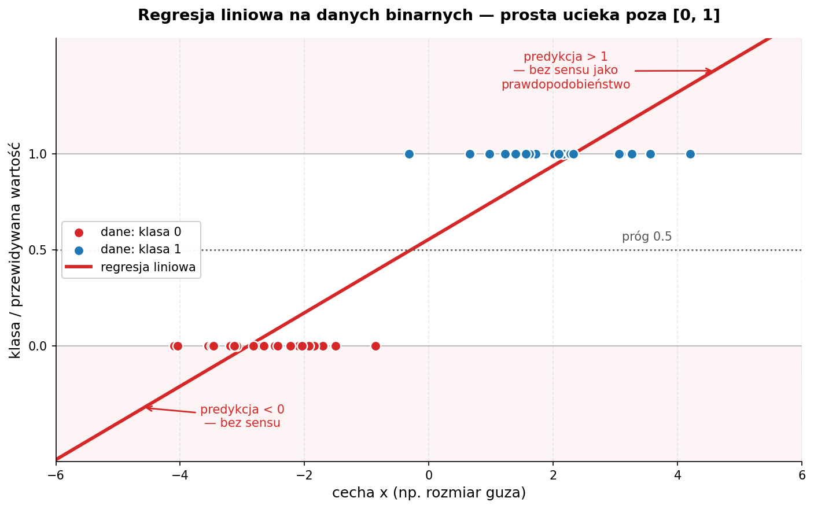
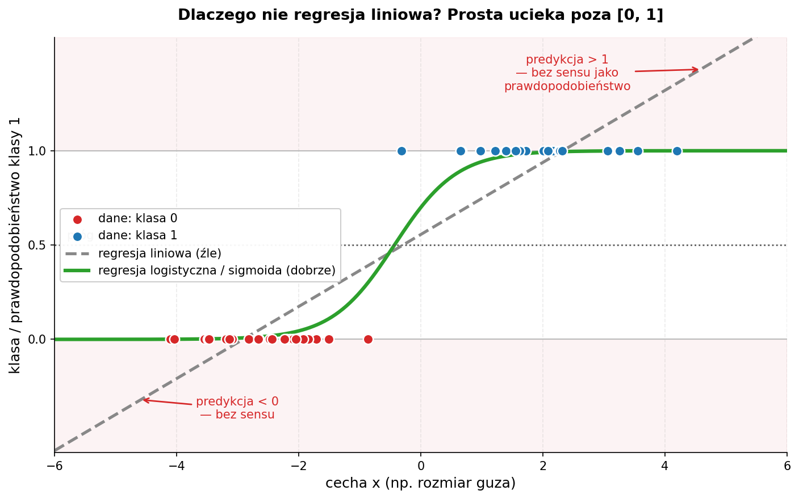

# Zajęcia 5

## Modele klasyfikacyjne — 6 algorytmów i kiedy którego użyć

> **Poprzednie zajęcia:** zbudowaliśmy regresję liniową i przeszliśmy pełny workflow ML — EDA, podział, trening, ewaluacja. Przewidywaliśmy **liczbę** (cenę, spalanie).
> Dziś przewidujemy **kategorię**: spam / nie-spam, przeżył / nie przeżył, nowotwór złośliwy / łagodny. To jest **klasyfikacja**. Dobra wiadomość: workflow zostaje ten sam. Zła (a właściwie ciekawa): zmieniają się **metryki**, dochodzi **skalowanie cech**, i poznajemy aż **6 różnych algorytmów**.

Po dzisiejszych zajęciach będziesz w stanie:

- wyjaśnić różnicę między klasyfikacją a regresją i dlaczego accuracy potrafi kłamać,
- czytać **macierz pomyłek** oraz metryki **precision / recall / F1 / ROC-AUC**,
- wiedzieć, **kiedy skalować cechy** (i dlaczego dla KNN/SVM to być albo nie być),
- wytrenować i porównać 6 klasyfikatorów: **regresję logistyczną, drzewo decyzyjne, las losowy, KNN, SVM i XGBoost**,
- dobrać model do problemu — wiedząc, co każdy z nich robi pod maską i czym płaci.

> **Środowisko:** Google Colab. Większość bibliotek jest preinstalowana; XGBoost instalujemy jedną linijką (patrz sekcja 9).

---

## 1. Klasyfikacja vs regresja — co się zmienia?

|  | Regresja (zajęcia 4) | Klasyfikacja (dziś) |
|---|---|---|
| **Cel (`y`)** | liczba ciągła (cena, spalanie) | kategoria / klasa (0 lub 1, „pies"/„kot") |
| **Wynik modelu** | konkretna wartość `ŷ` | **prawdopodobieństwo** przynależności do klasy → próg → klasa |
| **Metryki** | MAE, RMSE, R² | accuracy, precision, recall, F1, ROC-AUC |
| **Pytanie** | „ile?" | „która klasa?" |

Skupiamy się na **klasyfikacji binarnej** (dwie klasy: 0/1), bo na niej najłatwiej zrozumieć metryki. Wszystkie poznane modele radzą sobie też z wieloma klasami — `scikit-learn` ogarnia to za nas.

Kluczowa intuicja: klasyfikator zwykle nie mówi od razu „klasa 1". Najpierw zwraca **prawdopodobieństwo** (np. 0.83), a potem stosujemy **próg** (domyślnie 0.5): powyżej → klasa 1, poniżej → klasa 0. Ten próg będziemy mogli przesuwać — i to ma realne konsekwencje (zaraz zobaczymy, przy precision/recall).

---

## 2. Dane do przykładów i przygotowanie

Przykłady robimy na wbudowanym zbiorze **Breast Cancer Wisconsin** — 569 guzów opisanych 30 cechami numerycznymi, a celem jest klasyfikacja: **złośliwy (0) czy łagodny (1)**.

```python
import pandas as pd
from sklearn.datasets import load_breast_cancer

dane = load_breast_cancer(as_frame=True)
X = dane.frame.drop(columns=["target"])
y = dane.frame["target"]

print(X.shape)                      # (569, 30)
print(y.value_counts().to_dict())   # {1: 357, 0: 212} — 1=łagodny, 0=złośliwy
```

### Podział ze stratyfikacją

W klasyfikacji dochodzi jeden niuans względem zajęć 4: **`stratify=y`**. Gwarantuje, że proporcje klas w zbiorze treningowym i testowym będą takie same jak w całości. Bez tego przy niezbalansowanych danych może się zdarzyć, że jedna klasa wpadnie głównie do testu — i wyniki przestaną cokolwiek znaczyć.

```python
from sklearn.model_selection import train_test_split

X_train, X_test, y_train, y_test = train_test_split(
    X, y, test_size=0.2, random_state=42, stratify=y
)
```

### Skalowanie cech — nowość, która jest kluczowa dla połowy modeli

Część modeli (KNN, SVM, regresja logistyczna) liczy **odległości** albo jest wrażliwa na **skalę** cech. Jeśli jedna cecha ma wartości w tysiącach, a druga w setnych, ta pierwsza zdominuje obliczenia — nie dlatego, że jest ważniejsza, tylko dlatego, że ma większe liczby. Lekarstwo: **standaryzacja** (`StandardScaler`) — każdą cechę przeskalowujemy do średniej 0 i odchylenia 1.

```python
from sklearn.preprocessing import StandardScaler

scaler = StandardScaler()
X_train_s = scaler.fit_transform(X_train)   # uczymy skaler i przekształcamy TRAIN
X_test_s  = scaler.transform(X_test)         # TEST tylko przekształcamy
```

> **Najważniejsza zasada skalowania:** skaler **uczysz tylko na zbiorze treningowym** (`fit_transform`), a test tylko **przekształcasz** (`transform`). Gdybyś dopasował skaler do całości, informacja o teście „przeciekłaby" do treningu (*data leakage*) i ocena byłaby zawyżona.
>
> **Które modele wymagają skalowania?** KNN, SVM — **tak, koniecznie**. Regresja logistyczna — pomaga (szybsza zbieżność). Drzewo, las, XGBoost — **nie potrzebują**, bo dzielą dane progami, a nie liczą odległości. Skalowanie ich nie psuje, więc dla wygody można skalować wszystko.

---

## 3. Model 1 — Regresja logistyczna (nasz punkt odniesienia)

Mimo „regresji" w nazwie to **klasyfikator**. Pomysł: weź regresję liniową z zajęć 4, a jej wynik (dowolna liczba od −∞ do +∞) **przepuść przez funkcję sigmoidalną**, która ściśnie go do przedziału (0, 1) — i tak powstaje prawdopodobieństwo.



Powyżej 0.5 → klasa 1, poniżej → klasa 0. Wagi `w` są **interpretowalne** tak samo jak w regresji liniowej — dodatnia waga zwiększa prawdopodobieństwo klasy 1.



```python
from sklearn.linear_model import LogisticRegression

logreg = LogisticRegression(max_iter=5000)   # więcej iteracji = pewna zbieżność
logreg.fit(X_train_s, y_train)

y_pred  = logreg.predict(X_test_s)            # klasy (0/1)
y_proba = logreg.predict_proba(X_test_s)[:, 1]  # prawdopodobieństwa klasy 1
```

Na tym zbiorze regresja logistyczna jest **bardzo mocna** — ok. 98% trafień. To dobry punkt odniesienia: zanim sięgniesz po cięższe działa (XGBoost), zawsze warto zobaczyć, jak radzi sobie prosty, interpretowalny model.

---

## 4. Metryki klasyfikacji — bo accuracy potrafi kłamać

To najważniejsza sekcja teoretyczna dzisiejszych zajęć. Mamy predykcje — jak ocenić, czy są dobre?

### Macierz pomyłek (confusion matrix)

Wszystko zaczyna się tutaj. Zestawiamy, co model **przewidział**, z tym, co było **naprawdę**:

```
                      PRZEWIDZIANE
                  złośliwy    łagodny
PRAWDZIWE  złośliwy   TP          FN     ← FN = przeoczony nowotwór (groźne!)
           łagodny    FP          TN
```

- **TP** (true positive) — poprawnie wykryty złośliwy,
- **TN** (true negative) — poprawnie uznany za łagodny,
- **FP** (false positive) — fałszywy alarm (łagodny uznany za złośliwy),
- **FN** (false negative) — **przeoczony złośliwy** (uznany za łagodny).

```python
from sklearn.metrics import confusion_matrix, ConfusionMatrixDisplay

cm = confusion_matrix(y_test, y_pred)
ConfusionMatrixDisplay(cm, display_labels=["złośliwy", "łagodny"]).plot()
```

### Cztery metryki z tej tabelki

| Metryka | Wzór | Po ludzku |
|---|---|---|
| **Accuracy** | (TP+TN) / wszystko | jaki % wszystkich predykcji jest poprawny |
| **Precision** | TP / (TP+FP) | gdy model mówi „złośliwy", jak często ma rację |
| **Recall** (czułość) | TP / (TP+FN) | jaki % faktycznych złośliwych model **wyłapał** |
| **F1** | średnia harmoniczna precision i recall | jedna liczba balansująca oba |

### Dlaczego sama accuracy kłamie

Wyobraź sobie zbiór, gdzie 99% guzów jest łagodnych. Model, który **zawsze** mówi „łagodny", ma 99% accuracy — i jest **bezużyteczny**, bo nie wykrył ani jednego nowotworu (recall = 0%). To jest dokładnie powód, dla którego przy niezbalansowanych danych patrzymy na precision i recall, a nie na samą accuracy.

### Precision vs recall — i po co nam próg

Tu wraca próg decyzyjny z sekcji 3. To **kompromis**:

- chcesz wyłapać **wszystkie** nowotwory (wysoki recall)? Obniż próg — model będzie częściej krzyczeć „złośliwy". Cena: więcej fałszywych alarmów (niższa precision).
- chcesz, żeby alarm był **pewny** (wysoka precision)? Podnieś próg. Cena: kilka nowotworów się prześlizgnie (niższy recall).

W diagnostyce raka świadomie wybieramy **wysoki recall** — lepiej wezwać zdrowego pacjenta na dodatkowe badania (FP), niż przeoczyć chorego (FN). W filtrze spamu odwrotnie — wolisz wysoką precision (żeby ważny mail nie trafił do spamu). **To zależy od problemu, nie od modelu.**

### Jeden raport zamiast liczenia ręcznie

```python
from sklearn.metrics import classification_report

print(classification_report(y_test, y_pred,
                            target_names=["złośliwy", "łagodny"]))
```

### ROC-AUC — jakość niezależna od progu

Krzywa **ROC** pokazuje, jak zmieniają się trafienia i fałszywe alarmy, gdy **przesuwamy próg** przez cały zakres. Pole pod nią — **AUC** (Area Under Curve) — to jedna liczba podsumowująca jakość modelu **niezależnie od wyboru progu**:

- **AUC = 1.0** → idealny,
- **AUC = 0.5** → model nie lepszy niż rzut monetą,
- im bliżej 1.0, tym lepiej.

```python
from sklearn.metrics import roc_auc_score, RocCurveDisplay

auc = roc_auc_score(y_test, y_proba)        # uwaga: prawdopodobieństwa, nie klasy!
print(f"ROC-AUC: {auc:.3f}")                 # tu ~0.995

RocCurveDisplay.from_predictions(y_test, y_proba)
```

> **Pamiętaj:** accuracy/precision/recall/F1 liczymy z **predykcji klas** (`predict`), a ROC-AUC z **prawdopodobieństw** (`predict_proba`). To częsty błąd początkujących.

---

## 5. Model 2 — Drzewo decyzyjne

Najbardziej intuicyjny z modeli — to po prostu **gra w 20 pytań**. Model uczy się sekwencji warunków typu „czy cecha X > 5?", a każda odpowiedź prowadzi w dół drzewa aż do liścia z decyzją.

```
                  promień > 16?
                 ╱            ╲
              tak              nie
              ╱                  ╲
      tekstura > 22?          ŁAGODNY
        ╱        ╲
     ZŁOŚLIWY   ŁAGODNY
```

Na każdym podziale drzewo wybiera pytanie, które **najlepiej rozdziela klasy** (mierzone *gini* lub *entropią*). Kluczowy hiperparametr to **`max_depth`** — głębokość. Zbyt głębokie drzewo **przeucza się** (zapamiętuje pojedyncze przypadki); płytkie jest ogólniejsze.

```python
from sklearn.tree import DecisionTreeClassifier, plot_tree
import matplotlib.pyplot as plt

tree = DecisionTreeClassifier(max_depth=4, random_state=42)
tree.fit(X_train, y_train)   # drzewo NIE potrzebuje skalowania!

plt.figure(figsize=(16, 8))
plot_tree(tree, feature_names=X.columns, class_names=["złośliwy", "łagodny"],
          filled=True, fontsize=8)
plt.show()
```

**Zalety:** w pełni interpretowalne (można narysować i pokazać lekarzowi), nie wymaga skalowania, radzi sobie z nieliniowością. **Wady:** pojedyncze drzewo łatwo się przeucza i bywa niestabilne (mała zmiana danych → inne drzewo). Stąd pomysł na następny model...

---

## 6. Model 3 — Las losowy (Random Forest)

Skoro jedno drzewo bywa kapryśne — **zróbmy ich setki i pozwólmy głosować**. To *mądrość tłumu*: każde drzewo trenuje się na lekko innej próbce danych i innym podzbiorze cech (technika zwana *baggingiem*), a końcowa decyzja to **głosowanie większościowe**.

```
   🌳 → złośliwy        ┐
   🌳 → łagodny          │
   🌳 → złośliwy        ├──→ głosowanie → ZŁOŚLIWY (2:1)
   ... (×200)           ┘
```

Pojedyncze drzewa się mylą, ale ich **błędy się uśredniają**, a trafne odpowiedzi wzmacniają. Las prawie zawsze bije pojedyncze drzewo i jest dużo stabilniejszy.

```python
from sklearn.ensemble import RandomForestClassifier

forest = RandomForestClassifier(n_estimators=200, random_state=42)
forest.fit(X_train, y_train)   # też bez skalowania
```

Las daje też **ważność cech** (`feature_importances_`) — które cechy najczęściej decydowały o podziałach:

```python
import pandas as pd

waznosc = pd.Series(forest.feature_importances_, index=X.columns)
print(waznosc.sort_values(ascending=False).head(5))
```

**Zalety:** mocny „od ręki", odporny na przeuczenie, mało strojenia, ważność cech. **Wady:** tracimy czytelność pojedynczego drzewa (200 drzew się nie narysuje), wolniejszy i cięższy niż jedno drzewo.

---

## 7. Model 4 — KNN (k najbliższych sąsiadów)

Najprostszy pomysł ze wszystkich: **„jesteś taki, jak twoi sąsiedzi"**. Żeby sklasyfikować nowy punkt, KNN znajduje `k` najbliższych mu punktów ze zbioru treningowego i robi wśród nich głosowanie.

```
        ●  ●          ? = nowy punkt, k=3
      ●   ? ▲         najbliżsi sąsiedzi: ●, ●, ▲
        ●   ▲         głosy: 2× ● vs 1× ▲  →  klasa ●
```

KNN liczy **odległości** — dlatego **skalowanie jest absolutnie konieczne**. Bez niego cecha o dużych wartościach zdominuje odległość i wynik będzie bez sensu.

```python
from sklearn.neighbors import KNeighborsClassifier

knn = KNeighborsClassifier(n_neighbors=5)
knn.fit(X_train_s, y_train)   # KONIECZNIE dane przeskalowane!
```

Kluczowy hiperparametr to **`k`**: małe `k` (np. 1) jest czułe na szum, duże `k` wygładza granice decyzyjne. **Zalety:** zero założeń o danych, trywialny w idei. **Wady:** wolny przy predykcji (musi porównać się z całym zbiorem), kiepski przy wielu cechach (*klątwa wymiarowości*), wymaga skalowania.

---

## 8. Model 5 — SVM (maszyna wektorów nośnych)

SVM szuka **najszerszej możliwej „ulicy"** (marginesu) rozdzielającej dwie klasy. Im szerszy margines między klasami, tym pewniejsza i lepiej generalizująca granica. Punkty leżące na krawędziach tej ulicy to **wektory nośne** — to one definiują granicę (reszta danych jest nieistotna).

```
   ●  ●              │        ╲ margines
     ●  ●     ●      │   ▲      ╲
   ────────────●─────┼──────▲────  ← granica decyzyjna (środek ulicy)
     ●            ●  │   ▲ ▲     ╱
   ●     ●           │  ▲      ╱
                  najszersza „ulica" między klasami
```

A co, jeśli klas nie da się rozdzielić linią? Tu wchodzi **kernel trick** — SVM potrafi „zakrzywić" przestrzeń (jądro `rbf`), żeby znaleźć nieliniową granicę. SVM też liczy odległości, więc **skalowanie jest konieczne**.

```python
from sklearn.svm import SVC

svm = SVC(kernel="rbf", probability=True, random_state=42)
svm.fit(X_train_s, y_train)   # znów dane przeskalowane
# probability=True pozwala później na predict_proba (potrzebne do ROC-AUC)
```

**Zalety:** bardzo skuteczny na średnich zbiorach, dobrze radzi sobie z wieloma cechami, kernel trick łapie nieliniowość. **Wady:** wolny na dużych zbiorach, wymaga skalowania i strojenia (`C`, `gamma`), słabo interpretowalny.

---

## 9. Model 6 — XGBoost (król danych tabelarycznych)

Las losowy budował drzewa **niezależnie** i uśredniał. XGBoost robi coś sprytniejszego — buduje drzewa **po kolei**, gdzie **każde kolejne naprawia błędy poprzednich**. To **boosting**: zamiast tłumu niezależnych ekspertów masz sztafetę, w której każdy biegacz poprawia to, co zepsuł poprzedni.

```
   drzewo 1 ──→ błędy ──→ drzewo 2 (uczy się na błędach 1) ──→ błędy ──→ drzewo 3 ...
                                  └──────────── suma → predykcja ─────────────┘
```

To od lat **domyślny wybór do danych tabelarycznych** i najczęstszy zwycięzca konkursów Kaggle. Trzeba go doinstalować:

```bash
pip install xgboost
```

```python
from xgboost import XGBClassifier

xgb = XGBClassifier(
    n_estimators=200, max_depth=3, learning_rate=0.1, eval_metric="logloss"
)
xgb.fit(X_train, y_train)   # jako model drzewiasty — skalowania nie wymaga
```

**Zalety:** zwykle najwyższa jakość na danych tabelarycznych, ważność cech, radzi sobie z brakami. **Wady:** więcej hiperparametrów do strojenia, łatwiej przeuczić niż las, mniej interpretowalny.

---

## 10. Porównanie — kiedy czego użyć?

| Model | Skalowanie? | Interpretowalność | Szybkość treningu | Łapie nieliniowość | Typowe zastosowanie |
|---|---|---|---|---|---|
| **Regresja logistyczna** | pomaga | ⭐⭐⭐ wysoka | bardzo szybki | nie | baseline, gdy liczy się interpretacja |
| **Drzewo decyzyjne** | nie | ⭐⭐⭐ wysoka | szybki | tak | gdy trzeba pokazać reguły decyzji |
| **Las losowy** | nie | ⭐⭐ średnia | średni | tak | solidny „pierwszy strzał" bez strojenia |
| **KNN** | **konieczne** | ⭐ niska | brak (leniwy) | tak | małe zbiory, prosty baseline |
| **SVM** | **konieczne** | ⭐ niska | wolny na dużych | tak (kernel) | średnie zbiory, dużo cech |
| **XGBoost** | nie | ⭐ niska | średni | tak | maksymalna jakość na danych tabelarycznych |

**Reguła kciuka:**

- zacznij od **regresji logistycznej** (baseline + interpretacja),
- chcesz solidny wynik bez strojenia → **las losowy**,
- walczysz o ostatnie procenty jakości → **XGBoost**,
- mały zbiór / szybki prototyp → **KNN**,
- średni zbiór z wyraźną strukturą → **SVM**.

Wyniki na naszym zbiorze (test) — żeby zobaczyć rzędy wielkości:

| Model | Accuracy | F1 | ROC-AUC |
|---|---|---|---|
| Regresja logistyczna | 0.982 | 0.986 | 0.995 |
| SVM | 0.982 | 0.986 | 0.995 |
| Las losowy | 0.956 | 0.966 | 0.993 |
| XGBoost | 0.947 | 0.959 | 0.994 |
| KNN | 0.956 | 0.966 | 0.979 |
| Drzewo decyzyjne | 0.939 | 0.951 | 0.934 |

Zwróć uwagę: na tym akurat (małym, czystym, dobrze separowalnym) zbiorze **prosta regresja logistyczna wygrywa z XGBoostem**. To ważna lekcja — najcięższy model nie zawsze jest najlepszy. Zaczynaj od prostych.

---

## Łączymy wszystko — trenujemy i porównujemy 6 modeli naraz

Spięjmy całość w jedną pętlę, która trenuje wszystkie modele i zbiera metryki do tabeli porównawczej:

```python
import pandas as pd
from sklearn.linear_model import LogisticRegression
from sklearn.tree import DecisionTreeClassifier
from sklearn.ensemble import RandomForestClassifier
from sklearn.neighbors import KNeighborsClassifier
from sklearn.svm import SVC
from xgboost import XGBClassifier
from sklearn.metrics import accuracy_score, f1_score, roc_auc_score

# Skalujemy raz dla wszystkich — modele drzewiaste to zignorują, reszcie pomoże
modele = {
    "Regresja logistyczna": LogisticRegression(max_iter=5000),
    "Drzewo decyzyjne":     DecisionTreeClassifier(max_depth=4, random_state=42),
    "Las losowy":           RandomForestClassifier(n_estimators=200, random_state=42),
    "KNN":                  KNeighborsClassifier(n_neighbors=5),
    "SVM":                  SVC(probability=True, random_state=42),
    "XGBoost":              XGBClassifier(n_estimators=200, max_depth=3,
                                          learning_rate=0.1, eval_metric="logloss"),
}

wyniki = []
for nazwa, model in modele.items():
    model.fit(X_train_s, y_train)
    y_pred  = model.predict(X_test_s)
    y_proba = model.predict_proba(X_test_s)[:, 1]
    wyniki.append({
        "model":    nazwa,
        "accuracy": accuracy_score(y_test, y_pred),
        "F1":       f1_score(y_test, y_pred),
        "ROC_AUC":  roc_auc_score(y_test, y_proba),
    })

tabela = pd.DataFrame(wyniki).sort_values("F1", ascending=False)
print(tabela.to_string(index=False))
```

Jedna pętla, jeden ranking. Dokładnie tak wygląda pierwszy etap realnego projektu ML — zanim zaczniesz stroić hiperparametry, sprawdzasz, który rodzaj modelu w ogóle pasuje do Twoich danych.

---

## Praca projektowa

### Zadanie 5 — Titanic: kto przeżył? (20 pkt, podzielone na etapy)

> **Uwaga:** przykłady liczyliśmy na zbiorze breast cancer. **Zadania robisz na innym zbiorze — Titanic** (przewidujemy, czy pasażer przeżył katastrofę: `survived` = 0/1). Te same kroki, inne dane — przejdź cały proces samodzielnie.

Zbiór jest wbudowany w `seaborn`:

```python
import seaborn as sns
df = sns.load_dataset("titanic")
df.head()
```

---

#### 🏋️ Zadanie 5.1 — Przygotowanie danych (4 pkt)

Ten zbiór jest „brudniejszy" niż breast cancer i ma kilka pułapek.

1. **(1 pkt)** Wyświetl `shape`, `info()`, rozkład klas (`df["survived"].value_counts()`) oraz braki danych (`df.isna().sum()`). W komentarzu napisz, ile jest pasażerów, czy klasy są zbalansowane i które kolumny mają najwięcej braków.

2. **(1.5 pkt)** Wyczyść dane:
   - **Usuń kolumnę `alive`** — to **wyciek danych** (*data leakage*): `alive` to dosłownie to samo co `survived`, tylko jako tekst. Gdybyś ją zostawił, model miałby 100% i byłby bezużyteczny w praktyce.
   - Usuń kolumnę `deck` (zbyt dużo braków) oraz kolumny zdublowane/tekstowe powielające inne (`class`, `who`, `embark_town`, `adult_male`, `alone` — pochodne od pozostałych).
   - Zostaw cechy: `pclass`, `sex`, `age`, `sibsp`, `parch`, `fare`, `embarked`.
   - Uzupełnij braki w `age` **medianą**, a w `embarked` **wartością najczęstszą** (modą).

   W komentarzu wypisz, które kolumny usunąłeś i dlaczego usunięcie `alive` jest konieczne.

3. **(1 pkt)** Zakoduj cechy tekstowe na liczby — regresja i reszta modeli przyjmują tylko liczby. Najprościej `pd.get_dummies(df, columns=["sex", "embarked"], drop_first=True)`. Wyświetl `head()` po zakodowaniu.

4. **(0.5 pkt)** Rozdziel na `X` / `y` (`survived`), zrób **podział ze stratyfikacją** (`stratify=y`, `test_size=0.25`, `random_state=42`) i **przeskaluj** cechy `StandardScaler` (ucz skaler tylko na train!).

---

#### 🏋️ Zadanie 5.2 — Regresja logistyczna + metryki (4 pkt)

1. **(1 pkt)** Wytrenuj `LogisticRegression` na przeskalowanym zbiorze treningowym i zrób predykcje na teście.

2. **(1 pkt)** Wyświetl **macierz pomyłek** (`confusion_matrix` lub `ConfusionMatrixDisplay`). W komentarzu opisz, ile było FN (przeoczonych ocalałych) i FP.

3. **(1.5 pkt)** Policz **accuracy, precision, recall i F1**. Zinterpretuj **recall** w kontekście problemu (jaki % faktycznie ocalałych pasażerów model poprawnie wskazał?).

4. **(0.5 pkt)** Wyświetl `classification_report`.

---

#### 🏋️ Zadanie 5.3 — Drzewo i las losowy (4 pkt)

1. **(1 pkt)** Wytrenuj `DecisionTreeClassifier` (ustaw `max_depth`) i oceń accuracy + F1 na teście.

2. **(1 pkt)** Wytrenuj `RandomForestClassifier` (`n_estimators=200`) i oceń tak samo.

3. **(0.5 pkt)** Porównaj wyniki drzewa i lasu w komentarzu — który lepszy i czy to zgodne z intuicją z wykładu?

4. **(1.5 pkt)** Wyciągnij z lasu **ważność cech** (`feature_importances_`), wyświetl 5 najważniejszych (najlepiej jako wykres słupkowy). W komentarzu: które cechy najmocniej decydowały o przeżyciu? (Czy płeć i klasa biletu są na górze?)

---

#### 🏋️ Zadanie 5.4 — KNN i SVM + dlaczego skalowanie ma znaczenie (4 pkt)

1. **(1 pkt)** Wytrenuj `KNeighborsClassifier` na **przeskalowanych** danych dla dwóch różnych wartości `k` (np. 3 i 15). Porównaj F1.

2. **(1 pkt)** Wytrenuj `SVC` (`kernel="rbf"`) na przeskalowanych danych i oceń accuracy + F1.

3. **(1.5 pkt)** **Eksperyment ze skalowaniem:** wytrenuj KNN jeszcze raz, ale na danych **nieprzeskalowanych** (surowe `X_train`). Porównaj jego F1 z wersją przeskalowaną z punktu 1.

4. **(0.5 pkt)** W komentarzu wyjaśnij, dlaczego skalowanie zmieniło wynik KNN (a nie zmieniłoby wyniku lasu losowego).

---

#### 🏋️ Zadanie 5.5 — XGBoost + finałowe porównanie (4 pkt)

1. **(1 pkt)** Zainstaluj (`pip install xgboost`) i wytrenuj `XGBClassifier`. Oceń accuracy + F1.

2. **(1.5 pkt)** Narysuj **krzywą ROC** (`RocCurveDisplay`) dla co najmniej dwóch modeli na jednym wykresie i policz ich **ROC-AUC** (pamiętaj: `predict_proba`, nie `predict`).

3. **(1.5 pkt)** Zbuduj **tabelę porównawczą wszystkich 6 modeli** (accuracy, F1, ROC-AUC), posortowaną po F1 — wzorem sekcji „Łączymy wszystko". W komentarzu: który model wygrał na Titanicu i czy to ten sam, co na breast cancer?

---

## Podsumowanie punktacji

| Zadanie | Temat | Punkty |
|---------|-------|--------|
| 5.1 | Przygotowanie danych (czyszczenie, leakage, kodowanie, skalowanie) | 4 |
| 5.2 | Regresja logistyczna + metryki klasyfikacji | 4 |
| 5.3 | Drzewo decyzyjne + las losowy + ważność cech | 4 |
| 5.4 | KNN + SVM + eksperyment ze skalowaniem | 4 |
| 5.5 | XGBoost + ROC-AUC + finałowe porównanie | 4 |
| **Suma** | | **20** |

> Maksymalne **20 pkt** zdobywasz, prezentując rozwiązanie prowadzącemu na zajęciach. Zadanie wysyłasz na Moodle najpóźniej dzień przed kolejnymi zajęciami.

---

## Materiały dodatkowe

- [scikit-learn — Supervised learning](https://scikit-learn.org/stable/supervised_learning.html)
- [scikit-learn — metryki klasyfikacji](https://scikit-learn.org/stable/modules/model_evaluation.html#classification-metrics)
- [scikit-learn — `StandardScaler`](https://scikit-learn.org/stable/modules/generated/sklearn.preprocessing.StandardScaler.html)
- [scikit-learn — Random Forest](https://scikit-learn.org/stable/modules/ensemble.html#random-forests)
- [scikit-learn — SVM](https://scikit-learn.org/stable/modules/svm.html)
- [XGBoost — dokumentacja](https://xgboost.readthedocs.io/)
- [Macierz pomyłek i metryki — przystępne wprowadzenie](https://scikit-learn.org/stable/auto_examples/model_selection/plot_confusion_matrix.html)
